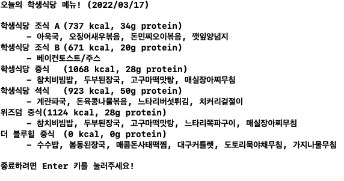
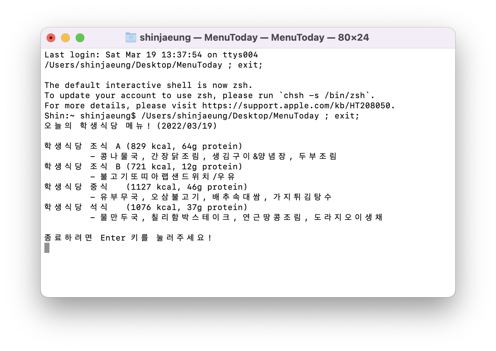

# MenuToday

- 기간 : 1일
- 설명 : Postech 복지회의 식단을 받아와서 보여주는 프로그램

 

## Demo

 

## 사용 방법

- 1. MenuToday 폴더 내의 MenuToday Unix 실행파일을 실행
- 2. MenuToday.xcodeproj를 열어 실행
- 3. ~~(가능하면)incoming webhook과 crontab을 이용하여 매일 ryver에 공유~~
